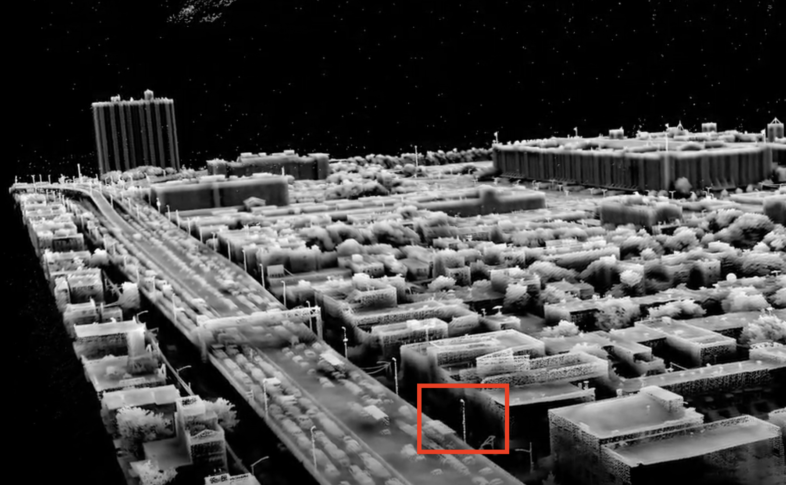
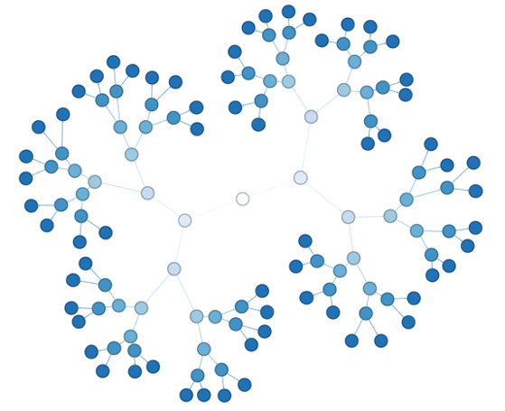

## NYUVIP-Point-Cloud-Data-Structure
### Urban LiDAR and Remote Sensing Data Structure Team Project

#### Create a virtual environment to run the programs in `tests` directory
```
python3.9 -m venv ENV_NAME
source ENV_NAME/bin/activate
pip install open3d
pip install networkx
```

Keywords: 

Urban Studies, Storage and Access of Point Cloud File, Data Structure

Data Citation:

Laefer, D.F., Vo, A.-V. 2020. “2019 LiDAR Data Collection for Sunset Park” NYU Spatial Data Repository, Brooklyn, NY” doi.org/10.17609/4cpx-2h33/. Available at http://hdl.handle.net/2451/60458

The lightpole data was retrieved at:




Some Images (still work in progress, definitely having some errors):



