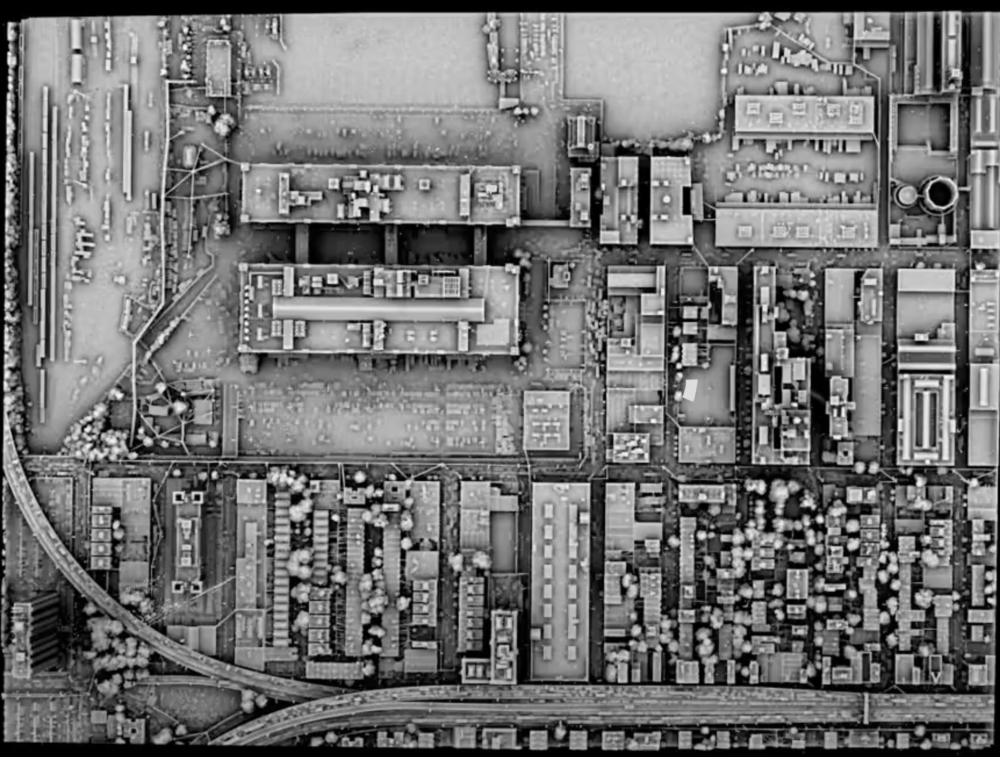
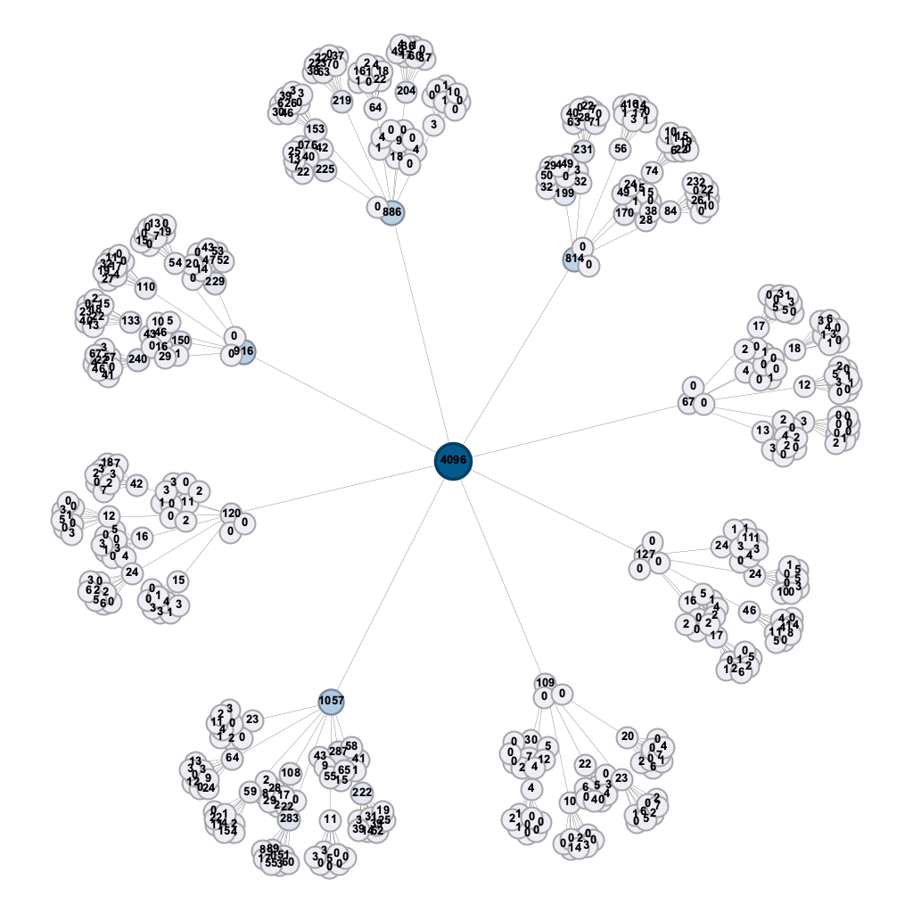
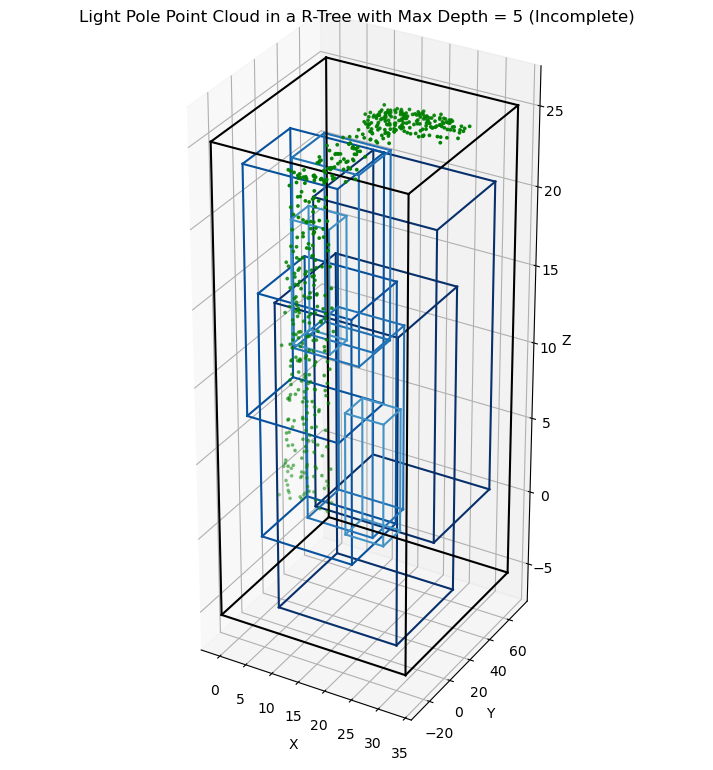

## NYU Urban LiDAR and Remote Sensing Data Structure Team Project

### Keywords: 

Urban Studies, Storage and Access of Point Cloud File, Data Structure

### Layout
```
.
├── .ideas/                          # trials for creating K-D tree visualizations
├── data/                            # point cloud files and images of the objects
│   ├── House/
│   ├── Light Pole/
│   └── Tree/
├── images/                          # used to decorate the README.md page
├── octree_visual_implementations/   # edge.csv and node.csv for creating network visualizations in Gephi
│   ├── Light Pole/
│   ├── House/
│   └── Tree/
├── tests/                           # trials for creating tree visualizations
│   ├── env/
│   └── gephis/
└── README.md
```

### Data:
```
Laefer, D.F., Vo, A.-V. 2020. “2019 LiDAR Data Collection for Sunset Park” NYU Spatial Data Repository, Brooklyn, NY” doi.org/10.17609/4cpx-2h33/. Available at http://hdl.handle.net/2451/60458
```



### Some visualizations (still a work in progress, likely containing errors):


