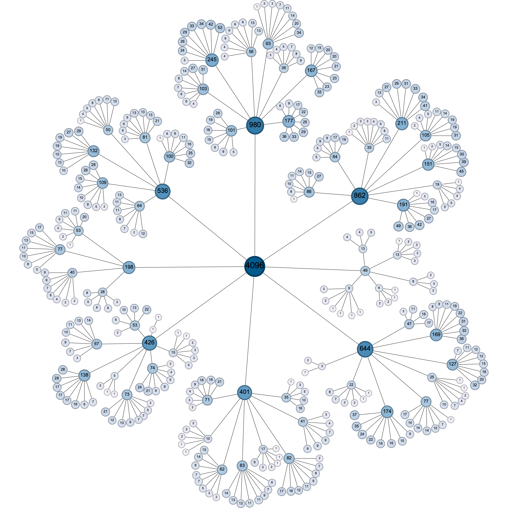
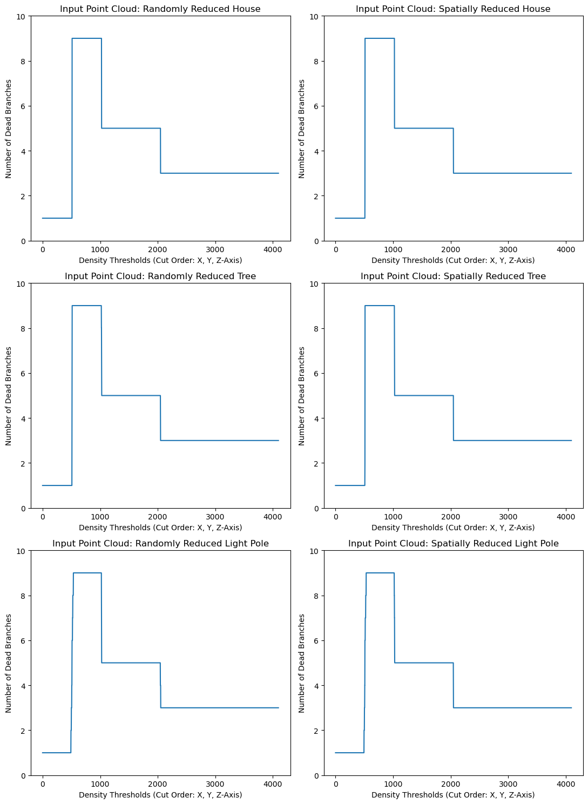
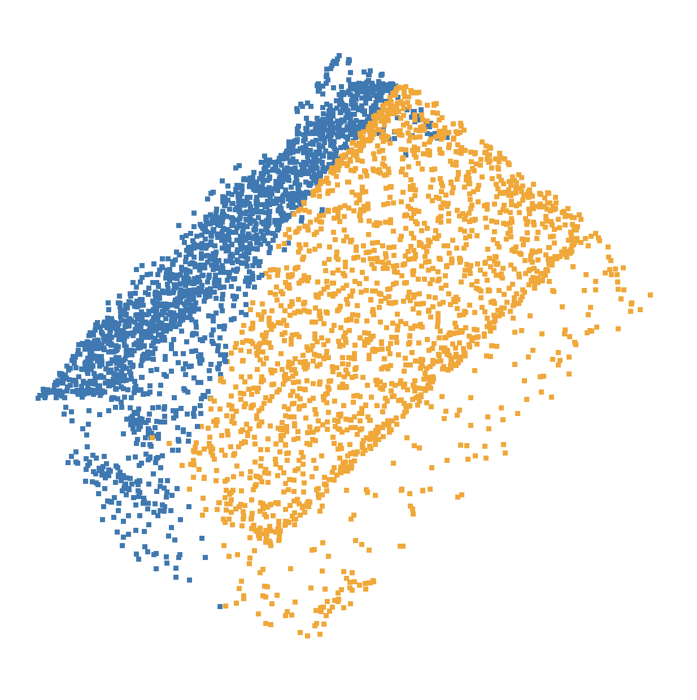
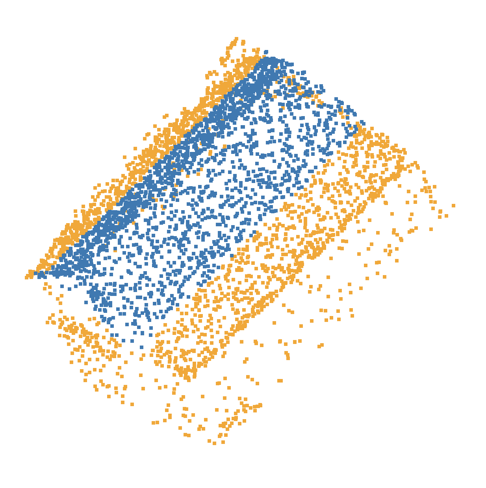

## NYU Urban LiDAR and Remote Sensing Data Structure Team Project

### Keywords: 

Urban Studies, Storage and Access of Point Cloud File, Data Structure

### Layout
```
.
├── data/                  # Point cloud data files (.las, .csv) and data visualization (.gephi)
│   ├── House/
│   ├── Light Pole/
│   └── Tree/
├── images/                # Images
│   ├── visualizations/    # Data visualizations/data flowers in Octree and K-D Tree data structures
├── tests/                 # Unused/Old python codes for data visualizations
│   ├── env/               # The environment for running test codes
├── Octree-Visual.ipynb/   # Octree Implementation and Visualization
├── KDTree-Visual.ipynb/   # K-D Tree Implementation and Visualization
├── RTree-Visual.ipynb/    # (incomplete) code for creating R tree visualization using matplotlib
└── README.md
```

### Data Source:
> Laefer, D.F., Vo, A.-V. 2020. “2019 LiDAR Data Collection for Sunset Park” NYU Spatial Data Repository, Brooklyn, NY doi.org/10.17609/4cpx-2h33/. Available at http://hdl.handle.net/2451/60458


### Sample Octree Visualization for a Randomly Subsampled Tree Point Cloud:



### Sample K-D Tree Visualization for a Randomly Subsampled Tree Point Cloud:


### Example of Octree-Based Structural Visualization


### Example of K-D Tree-Based Structural Visualization



### Two orders of Producing K-D Trees were Employed

**Here is a visualization of how a house point cloud was cut along with the x-axis first**



**Here is a visualization of how a house point cloud was cut along with the z-axis first**

