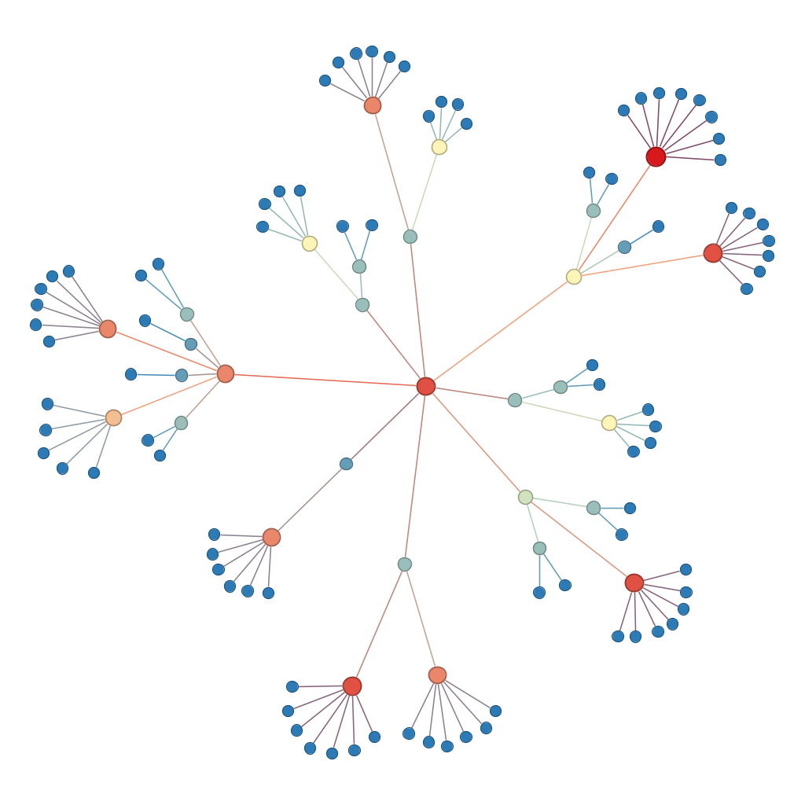
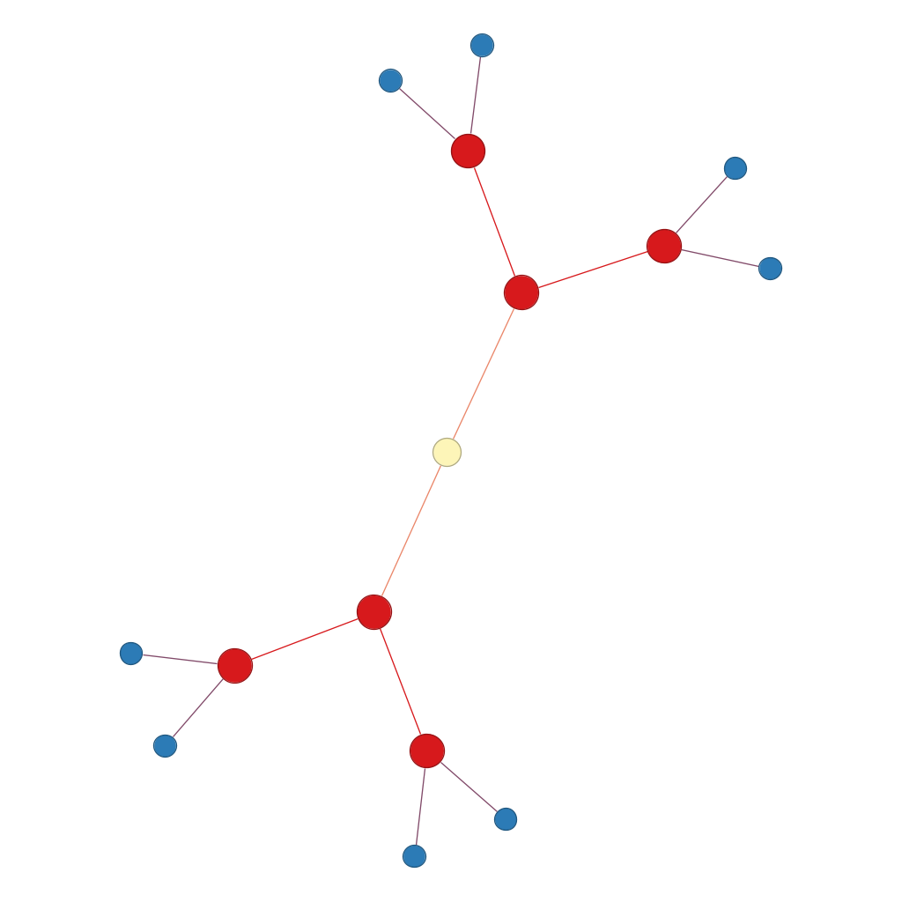
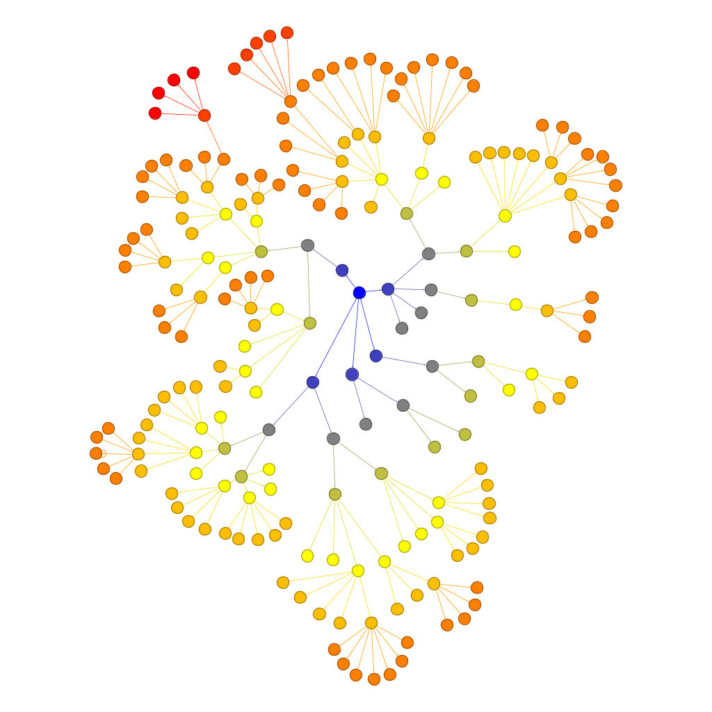
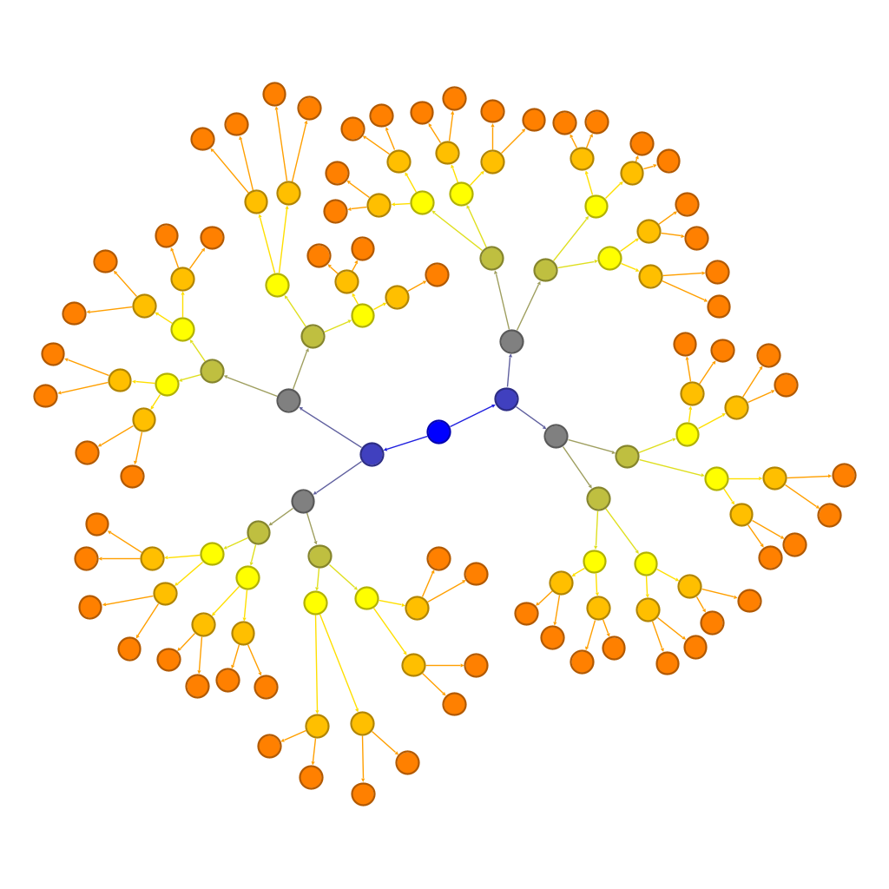

## NYUVIP-Point-Cloud-Data-Structure
### NYU Urban LiDAR and Remote Sensing (GY) Team Project

#### Create a virtual environment to run the programs in tests directory
```
python3.9 -m venv ENV_NAME
source ENV_NAME/bin/activate
pip install open3d
pip install networkx
```

Sample Point Cloud File


You may inspect the octree structure of the sample point cloud in Open3D.


You can also inspect the octree or k-d tree structure of the file using the code in the test file, and clean the graph using Gephi.




Here is a  more complicated example with larger point cloud file in octree structure.


