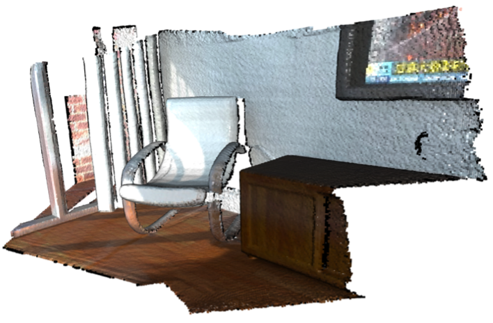
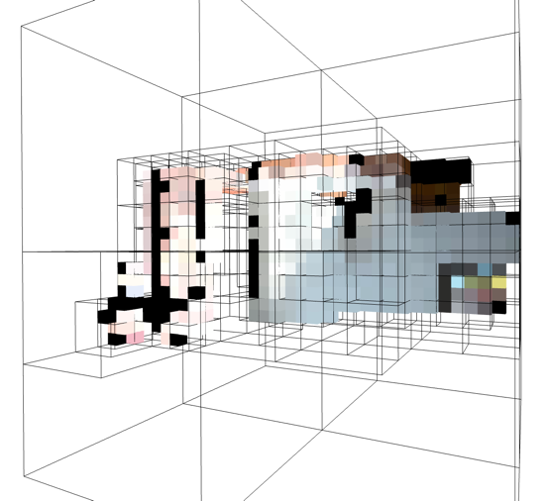
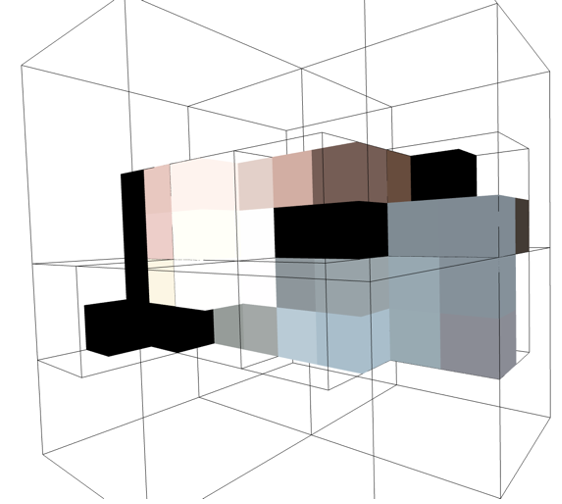
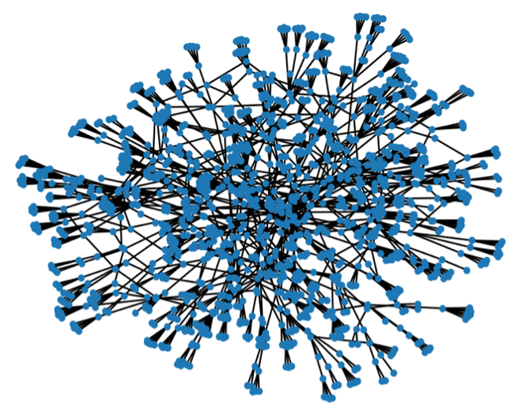
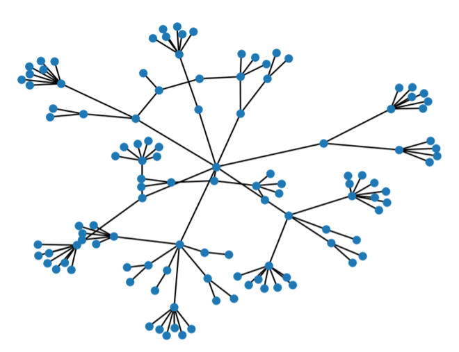
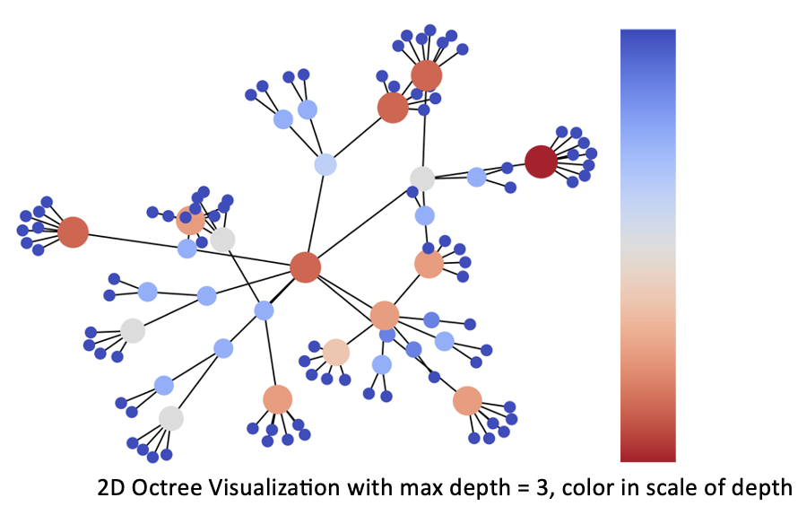

## NYUVIP-Point-Cloud-Data-Structure
### NYU Urban LiDAR and Remote Sensing (GY) Team Project

#### Create a virtual environment to run the programs in tests directory
```
python3.9 -m venv ENV_NAME
source ENV_NAME/bin/activate
pip install open3d
pip install networkx
```

#### Sample point cloud data shape: (196133, 3)


#### Analyze the Sample Point Cloud file in Octree Structure using Open3D



#### Analyze the Sample Point Cloud file in Octree Structure using Matplotlib, NetworkX, NumPy



#### A Better Visualization in 2D?


#### Time spent of running tests/test2_networkx.py in relation to the desired depth of the Octree
Time Spent = Time to load data file + Time to Construct Octree + Time to Visualize data file
| Depth         | Time Spent(s) |
| ------------- |:-------------:|
| 3             | ~1.41         |
| 4             | ~1.97         |
| 5             | ~4.84         |